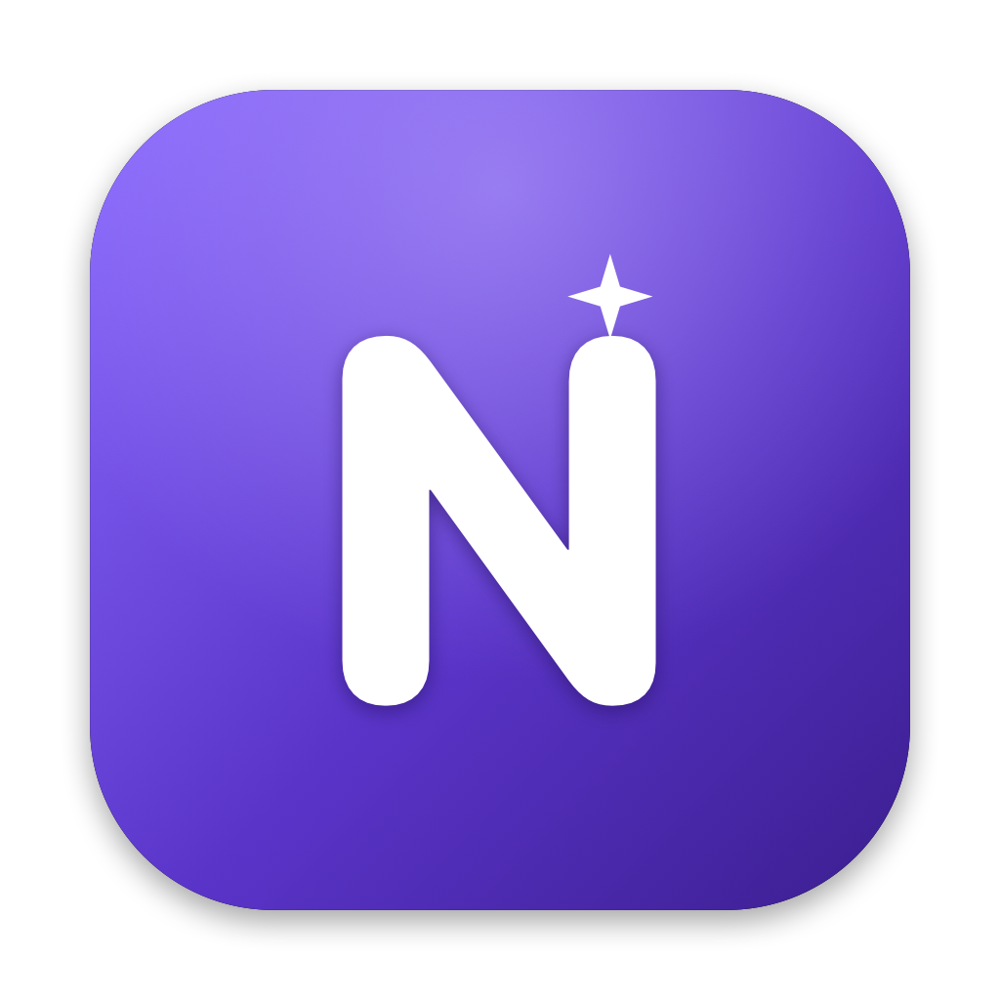

<div align="center">
  
  <h1>Norte</h1>
  <p><b>A native Kanban + calendar app for your Mac, built to organize the day-to-day of people who ship code.</b></p>
  <p>
    
    
    
    
  </p>
</div>

Norte is a **native macOS app** (SwiftUI) that brings together everything a
developer needs to stay on top of multiple fronts: a **task Kanban** (with
context per company/project, urgency, and deadlines) and your **weekly
calendar** — all with **desktop widgets** so you can glance at your day without
opening anything.

No cloud, no login, no server, and **no cost**: your data stays on your Mac and
the calendar comes from the system's own calendar (which already syncs with your
Google Calendar).

> **Built for real dev life:** working across two companies + a side project +
> university without becoming a hostage to ten browser tabs.

## Features

- **Kanban** with Backlog → To Do → Doing → Done columns, drag-and-drop, color
  by **context** (company/project), **urgency** (high/medium/low), and deadlines
  with a countdown.
- **Recurring tasks** (daily/weekly/biweekly/monthly) — completing one
  automatically creates the next occurrence.
- **Weekly calendar** in a colored grid, showing events from your Google
  Calendar.
- **Create events** straight from the app, in the context's calendar.
- **Desktop widgets**: week grid, day list, and a mini-Kanban of upcoming tasks.
  Clicking a widget opens the app; clicking a task opens it for editing.
- **Smart mirror**: tasks with a deadline become events in a hidden "Tasks"
  calendar, so they show up in your agenda (and widgets) automatically.

## Install on Mac

Requirements: **Xcode** and **[XcodeGen](https://github.com/yonyz/XcodeGen)**
(`brew install xcodegen`).

```sh
git clone https://github.com/phmucelin/norte.git
cd norte
./scripts/install-mac.sh
```

This script generates the project, builds in **Release** (important: macOS
widgets only register in Release), installs **Norte.app** into `/Applications`,
and reloads the widgets. On first launch, grant calendar access.

Then: right-click the Desktop → **Edit Widgets** → **Norte** → drag "My Week",
"My Day", or "Upcoming Tasks".

> If the widgets appear grayed out, that's a macOS setting, not the app:
> **System Settings → Desktop & Dock → Widgets → Widget style → Full color**.

## iPhone — coming soon

The **iPhone** version (calendar + lock-screen widgets) **is on the way**, but is
**not ready for use yet**. The iOS app code is already in the repo, but it still
needs polish and distribution (Apple account). Stay tuned for upcoming releases.

## Development

```sh
cd NorteKit && swift test     # unit tests for the logic (models, sync, agenda)
xcodegen generate             # (re)generate Norte.xcodeproj
open Norte.xcodeproj          # open in Xcode
```

**Architecture:** a local `NorteKit` package (models, mirroring engine, agenda
helpers, EventKit service — all testable) + thin SwiftUI apps for macOS/iOS and
the widget extension. Details in
[`docs/superpowers/specs`](docs/superpowers/specs).

## Contributing

Issues and PRs are welcome. This is a personal project that became open source to
help other developers stay organized. Ideas for widgets, themes, and
integrations are especially appreciated.

## License

MIT — see [LICENSE](LICENSE). Use, modify, and share freely.
